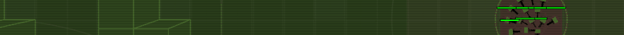

Remake of the original Lost Beacons game that participated in 2017 js13kGames competition [here](http://2017.js13kgames.com/).
 I've smoothed some corners and added a few features. 
<a title="Buy me a cup of coffee!" href="https://www.paypal.me/biteofpie"></img></a>
## GAME IMPROVEMENTS
[gf]: #game-features
Here is a short list of improvements made to the game:
* Improved overall performance
  * Caching font characters
  * Optimized AI units management
  * Invisible objects (e.i. those that aren't in viewport) aren't rendered
* Design
  * Cursor:
      * Replaced browser cursor by the in-game one (canvas-rendered)
      * Borderless selection rectangle
  * Redesigned & simplified minimap
  * Simplified main HUD (below the screen)  
  * Colors of map now dynamically changed on every new game level
  * Maps now have no obstacles on the borders
* Gameplay:
  * Wins indefinitely if all beacons are captured
  * New units: Destructor, Killer, Beast
  * Empowered and balanced AI performance
#### DISABLED FEATURES
Please don't worry if you find something is missing.
 Several features from the original game were intentionally turned off due to
 performance loss.

## CREDITS/CONTACT AUTHOR
[c]: #creditscontact-author 'Credits & author\'s contacts info '
You can follow me on [twitter](https://twitter.com/biteofpie) or just [email](mailto:al.neodim@gmail.com) me.
## ACKNOWLEDGMENTS
[acc]: acknowledgments

Author of the original Lost Beacons: [github/remvst](https://github.com/remvst)
### BUGS
There are several well-known bugs that I've left unsolved due to lack of the time on my hands. If you have found some please fill issue.  

### LICENSE
TBA

Return me back to the **[game improvements][gf]**

